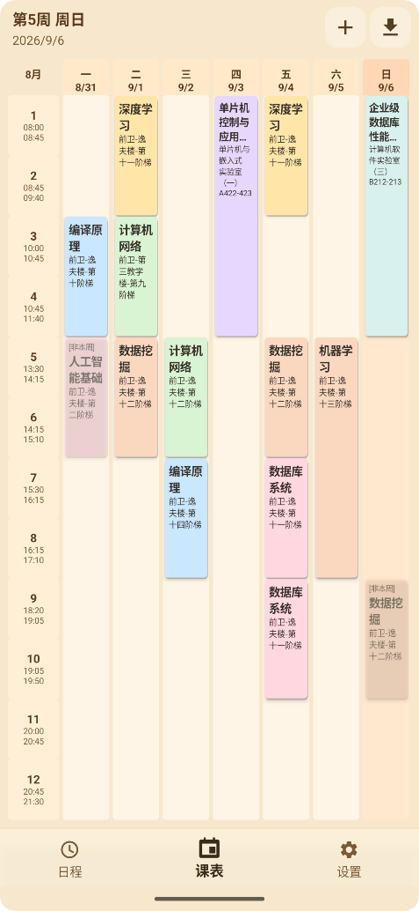
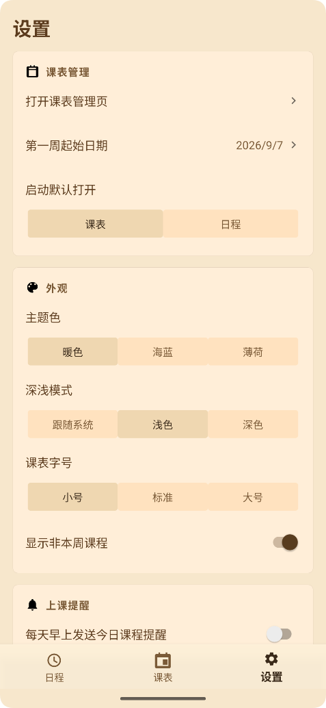

# JLU_schedule

吉林大学课表应用，开源、无广告。支持 Android / iOS / 鸿蒙三端（采用"双原生轻量移植"架构，Android 为主版本，详见 [docs/PORTING.md](docs/PORTING.md)）。

## 项目简介

JLU_schedule 是一个面向吉大学生的课表工具，支持通过教务网页导入课表、管理多份课表、手动补课、查看今日课程，并提供可切换的主题外观与深色模式。

## 安装包下载

- Android: 从 [GitHub Releases](https://github.com/JFyuhong/JLU_schedule/releases) 下载正式安装包。国内镜像目前受域名备案或接入备案阻断，暂不可稳定使用。
- iOS / 鸿蒙：源码位于 `ios/` 与 `harmonyos/` 目录，需自行用 Xcode / DevEco Studio 构建签名（构建说明见 PORTING.md）
- iOS 备注: 如果你能帮我搞定`99$/每年`的开发者计划的话，上架 TestFlight 也不是不行😂

## 效果截图

| 日程 | 课表 | 设置 |
| -- | -- | -- |
|  |  |  |

## 主要功能

- 教务课表解析
	- 支持解析教务系统 `.do` 返回的 `datas.*.rows` 数据
	- 支持从 `YPSJDD` 解析周次、星期、节次、地点
- 网页导入课表
	- 支持校内入口与校外 VPN 入口
	- 支持导入到当前课表或新建课表
- 多课表管理
	- 课表管理页可查看所有课表
	- 支持切换当前课表、重命名、删除、新建空课表
- 手动添加课程
	- 可设置课程名、教师、地点、星期、节次、周次、单双周
- 今日课程视图
	- 展示今日课程列表、课程数量、最早/最晚上课时间
	- 时间轴卡片式排版，正在进行的课程带"进行中"标识
- 桌面小组件
	- 在桌面直接查看今日课程与当前节次
- 上课提醒
	- 每日固定时间推送当日课程提醒，时间可自定义，重启后自动恢复（默认关闭）
- 数据安全
	- 存储写入原子化 + 并发加锁，元数据损坏自动从课程文件恢复
	- 课表文本导出 / 全量备份与恢复（JSON）
- 工具页（底部导航）
	- 绩点计算器：支持从教务系统一键拉取全部成绩自动计算，也可手动录入（百分制 / 五级制）；实时估算保研绩点（4.0 制）、加权平均分与算术平均分，逐门可计入/排除，重修同课程号自动取最高分（原生改造自 [DailyPotato/JLU-GPA-Calculator](https://github.com/DailyPotato/JLU-GPA-Calculator) 与 [Coldymemos/JLU-GPA-Calculator-for-Windows-Desktop](https://github.com/Coldymemos/JLU-GPA-Calculator-for-Windows-Desktop)，已获原作者同意）
- 个性化设置
	- 主题色切换（暖色、海蓝、薄荷），支持深色模式（跟随系统/浅色/深色）
	- 默认打开页面
	- 课表字号三档（小号 / 标准 / 大号）
	- 是否显示非本周课程
	- 自定义背景（选择与裁剪）
- 课程详情
	- 上拉浮动卡片展示教师 / 地点 / 周次 / 学期，点击条目一键复制

## 技术栈

- Android (Kotlin, WebView 导入, Material Components)
- iOS (SwiftUI, WKWebView 导入, UNUserNotification 提醒)
- 鸿蒙 (ArkUI, ArkWeb 导入, reminderAgentManager 提醒)
- Kotlinx Serialization / Swift Codable / ArkTS（三端统一 v1 备份格式）
- Gradle (KTS) / Xcode / DevEco Studio

## 项目结构

- `app/src/main/java/cn/jlu/schedule/`
	- `ui/`：课表页、今日课程页、设置页、导入 Activity、工具页（绩点计算器）、主题
	- `data/`：偏好设置、课表持久化、多课表元数据、备份编解码
	- `domain/`：周次推算、绩点计算等纯逻辑（JUnit 覆盖）
	- `parser/`：教务 `.do` 数据解析器
	- `auth/`：统一身份认证（cas.jlu.edu.cn TPASS）原生客户端、加密凭据存储、持久化 CookieJar
	- `remote/`：教务平台 HTTP 客户端、端点注册表、一键导入编排
	- `widget/`：今日课程桌面小组件
	- `reminder/`：每日课程提醒
- `ios/`：iOS 版（SwiftUI，核心逻辑与 Android 逐函数对齐，XCTest 覆盖）
- `harmonyos/`：鸿蒙版（ArkUI，核心逻辑可用 `node verify/run.mjs` 在任意平台回归）
- `docs/PORTING.md`：三端同步开发指南与核心逻辑对应表
- `app/src/main/assets/`
	- `target.url`：校内导入入口
	- `VPN.url`：校外导入入口

## 更新日志
- v2.2.1（Android）
	- 课表详情支持删除手动添加和教务导入课程；只删除当前课表中的选中课程
	- 修复考试安排与学业完成查询原网页的 404，按教务门户实际入口更新地址
	- 修复同版本检查更新误报失败，以及设置页底部版本号写死为 2.1.0 的问题
	- 国内镜像仍受域名备案限制，当前通过 GitHub Release 提供下载
- v2.2.0（Android）
	- 新增应用内更新：国内站点与 GitHub 双镜像，更新清单验签，APK 哈希、包名、版本号和正式证书校验，支持断点续传与镜像切换
	- 修复课程时间冲突时被置顶课程遮挡的展示问题，完善工具页和统一认证登录稳定性
	- 修复更新检查在断网后被延迟 24 小时、下载弹窗关闭后继续下载等问题
	- 第一周日期设置会明确提示非周一日期的换算结果和保存状态
- v2.1
	- 底部导航新增"工具"页，加入绩点计算器：支持从教务系统一键导入全部成绩自动计算，也可手动录入百分制 / 五级制成绩；实时计算保研绩点（90+→4.0 档位映射）、加权平均分、算术平均分，逐门计入/排除、重修同课程号自动取最高并本地持久化；计算规则原生改造自 DailyPotato/JLU-GPA-Calculator 与 Coldymemos/JLU-GPA-Calculator-for-Windows-Desktop（已获原作者同意），非官方规则，以学院文件为准
	- 成绩导入采用隐藏 WebView 捕获成绩页自身接口响应（教务网关拦截原生直连），会话失效时按"迁移 WebView Cookie → CAS TGT 续链 → 凭据静默重登"三级自动恢复，均不可用再引导登录并自动重试
	- 修复静默重登链路多处断点：会话过期时教务域直接返回登录页 HTML 的内容级检测、误判"需要验证码"导致从未尝试登录的预检、登录成功判据改为真会话探测（门户外壳页/过期 Cookie 不再误判）、原生请求对 *.jlu.edu.cn 沿用页面已确认的证书信任、登录后按业务路径全量迁移 WebView 会话 Cookie
	- 修复登录页白屏：校园私有 CA 证书错误改为与网页导入一致的逐主机人工确认弹窗
	- "记住密码"开启时自动捕获本次密码登录实际提交的凭据并加密存储（扫码登录不含凭据，不保存）
- v2.0
	- 新增校园账号登录：设置页"校园账号"卡片 + 内嵌统一身份认证登录页（cas.jlu.edu.cn TPASS）
	- 首次登录复用 WebView 会话；登录成功后 Cookie 自动迁移进原生客户端持久化
	- 新增"一键导入课表"：复用内置浏览器的登录 Cookie，隐藏 WebView 自动打开课表页捕获接口数据并入库，全程免操作（登录 Cookie 来自"我在校内"网页导入或校园账号登录）；校园域私有证书沿用网页导入时用户的信任决策自动放行
	- 修复一键导入缺课：滚动静默期收齐页面全部课表查询后再统一入库
	- 会话持久化策略：Cookie 落盘跨启动复用 + 访问前校验 + 失效静默重登（TPASS 3DES 加密提交，已与网页端 des.js 逐字节对拍）
	- 密码经 Android Keystore 加密存储（EncryptedSharedPreferences），不参与云备份/设备迁移
	- 服务层骨架：为成绩查询、绩点计算、考试安排、培养方案查询预留端点注册表（待真实账号抓包确认后实现）
- v1.0 项目初始化更新
- v1.1
	- 修复导入缓存竞态，降低“从此处导入”误报找不到课表的概率
	- 支持真实接口返回字符串数字时的课程 JSON 解析
	- 修复镜像请求错误改写非 GET 请求的问题
	- 修复切换学期导入后不同学年课表叠加的问题
	- 导入解析逻辑从 Activity 拆出并补充单元测试
	- 每份课表独立保存学期开始日期，导入时自动推断
	- 增加导入页捕获状态、手动加课校验、原子写入与日志提示
	- 清理 lint warning，并同步 target/compile SDK 到 36
- v1.2
	- 存储层加锁串行化，修复并发写入时元数据互相覆盖、临时文件交错损坏的问题
	- meta.json 损坏时不再清空全部课表：自动从课程文件恢复，并保留损坏文件用于排查
	- 修复删除课表先删文件后写元数据、导入覆盖非事务写入可能导致的悬空引用
	- 周次解析增强：支持离散周次（第1,3,5周）、全角括号单双周、独立"单周/双周"、中文逗号分段、节次/周次反写自动纠正
	- 统一默认学期开始日期逻辑，修复 9 月导入推断失败时周次被错钳到最后几周的问题
	- 课表页保留用户浏览的周次，不再每次回到前台强制跳回本周；今日页支持跨午夜刷新
	- 修复导入等待期间退出页面弹出对话框导致的崩溃（BadTokenException），导入改为协程 + 页面销毁保护
	- 导入按钮防抖、手动加课防抖；导入页支持 WebView 后退、旋转不再丢失浏览状态
	- 修复取消裁剪仍把原图设为背景的问题；清理历史导入缓存目录与残留临时文件
	- 移除 gradle.properties 中机器专属 JDK 路径，修复他机构建失败
	- 新增 WeekScheduleCalculator、ImportedScheduleStorage 单元测试，覆盖单双周、历史周、meta 恢复与并发写入
	- 主题系统重构：三处重复色板合并为单一来源，全部界面跟随主题色联动；新增深色模式（跟随系统/浅色/深色）
	- 数据层重构为 ScheduleRepository + StateFlow 单向数据流，数据变化自动刷新界面与小组件，移除主线程文件 IO 和"重建页面"式刷新
	- 新增桌面小组件：在桌面直接查看今日课程
	- 新增每日课程提醒通知，时间可自定义，重启后自动恢复
	- 新增课表文本导出与全量备份/恢复（JSON 文件）
	- 裁剪输出改用 FileProvider；导入页 SSL 证书校验失败改为逐主机人工确认，不再静默放行
	- 升级 AGP 8.9.2 / Gradle 8.11.1，移除 compileSdk 36 抑制项；启用 R8 代码收缩与混淆
	- 大量界面文案迁移到 strings.xml 资源
	- 设置页重构为卡片分组式排版，分段选择器支持即时刷新高亮
	- 课程详情改为浮动卡片样式，支持点击条目复制到剪贴板
	- 今日页改为时间轴卡片视觉，进行中课程显示"进行中"标识
	- 重绘全套矢量图标（底栏导航 / 设置页 / 详情页 / 右上角操作），修复启动图标缺失与个别图标边缘截断
	- 课表网格字号重新调优：三档字号（小号/标准/大号），中文课程名与地点在窄列下自动缩放换行
	- 上课提醒默认改为关闭，避免首次使用即弹通知
	- 深色模式课程块改为同色相深色底 + 粉彩浅色文字，消除深色界面上的高亮刺眼色块
	- 修复手动加课弹窗输入框聚焦后边框变短的问题

## 快速开始

1. 使用 Android Studio 打开仓库根目录。
2. 等待 Gradle Sync 完成。
3. 运行 `app` 模块到模拟器或真机。

命令行构建：

```bash
./gradlew assembleDebug
```

Windows PowerShell：

```powershell
.\gradlew.bat assembleDebug
```

## 使用说明

1. 打开课表页，点击导入按钮。
2. 选择“我在校内”或“我在校外”。
3. 在网页中进入到课表页面后，点击“从此处导入”。
4. 选择覆盖当前课表或新建课表导入。
5. 可在设置页进入“课表管理页”切换或整理课表。

## 开发说明

- 仓库已配置 `.gitignore`，默认忽略构建产物与本地环境文件。
- 提交前建议执行：

```bash
./gradlew assembleDebug
```

## 免责声明

本项目仅用于学习与个人效率提升，请遵守学校相关系统使用规范与法律法规。
