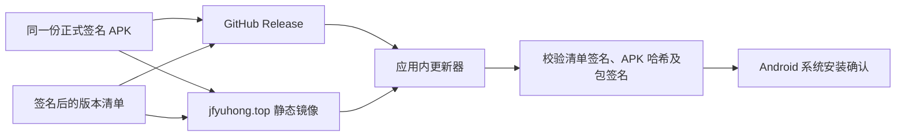

# Android 应用内更新设计

状态：设计稿。适用于从 GitHub Release 或项目网站安装的 `cn.jlu.schedule` Android APK；不涉及 iOS、鸿蒙或应用商店内更新。

## 1. 现状与目标

- 仓库的 Android 包名是 `cn.jlu.schedule`，`minSdk=26`。当前工作区 `versionCode=5`、`versionName=2.1.0`。
- GitHub 最新公开 Release 是 `v1.2`，APK 的 `versionCode=3`，签名证书 SHA-256 为 `7ed7c719a6abb18d1eb014a18c173532fd4f11fb4bd350f003245549135dd6dc`（CN=Zitao Wang）。本机 Debug APK 是另一张证书，不能用正式 APK 覆盖安装。
- 现有 `.github/workflows/android.yml` 仅执行测试、Debug 构建和 Lint；没有正式版签名、Release、镜像发布步骤。
- 项目网站 `jfyuhong.top` 已由服务器上的 Nginx 通过 HTTPS 提供，静态站点根目录为 `/var/www/html`。设计使用网站作为国内入口，GitHub Releases 作为海外入口。上线前需确认 HTTPS 证书自动续期；当前证书到期时间为 2026-11-20 UTC。

目标是**自动发现新版本、在应用内展示更新内容、选择可用镜像下载并校验 APK，最后交给 Android 系统安装界面**。不在后台静默安装，不自动请求安装权限，也不从不可信链接安装文件。

## 2. 组件和信任边界



- **发布身份**：正式 APK 必须始终由 v1.2 使用的签名密钥签名；构建脚本应在上传前核对上述证书指纹。密钥和密码不进入仓库或服务器。
- **元数据身份**：版本清单另用一把离线保管的 RSA 签名密钥，应用内固定其公钥。清单镜像即使被篡改，也不能让客户端接受未签名的版本信息。
- **传输**：清单和 APK 均只用 HTTPS。更新器使用独立、无 Cookie 的 OkHttpClient，不复用校园登录的 `JwApiClient`，避免向更新站点发送教务 Cookie。
- **最终安装身份**：客户端下载后仍核对 SHA-256、包名、`versionCode` 和 APK 签名证书。Android 系统安装器再执行平台自身的签名校验。

## 3. 地址和清单格式

稳定版只认下列两个清单入口。两端发布**完全相同的字节**：

1. 国内：`https://jfyuhong.top/updates/android/stable.json`
2. 海外：`https://github.com/JFyuhong/JLU_schedule/releases/latest/download/stable.json`

清单是一个 JSON 信封，`payload` 为 Base64URL 编码的 UTF-8 JSON 原始字节，`signature` 为针对这些**原始字节**计算的 `SHA256withRSA` 签名。先验签，再解析业务字段，避免 JSON 字段顺序、空白和转义造成签名歧义。`keyId` 用于以后增加公钥；旧公钥保留到所有仍可更新的客户端淘汰。

示例 payload（版本号和摘要仅示意，不得直接发布）：

```json
{
  "schema": 1,
  "packageName": "cn.jlu.schedule",
  "channel": "stable",
  "versionCode": 6,
  "versionName": "2.2.0",
  "minSdk": 26,
  "publishedAt": "2026-10-01T00:00:00Z",
  "notes": ["修复若干问题", "改进设置页"],
  "apk": {
    "size": 10000000,
    "sha256": "64 位小写十六进制 SHA-256",
    "signerSha256": "7ed7c719a6abb18d1eb014a18c173532fd4f11fb4bd350f003245549135dd6dc",
    "mirrors": [
      "https://jfyuhong.top/updates/android/versions/6/JLU_schedule.apk",
      "https://github.com/JFyuhong/JLU_schedule/releases/download/v2.2.0/JLU_schedule.apk"
    ]
  }
}
```

清单版本只在 `versionCode > BuildConfig.VERSION_CODE` 时可提示安装。拒绝包名不符、过长的更新说明、非 HTTPS 下载地址、未知 schema、无效签名或异常 APK 大小。两端返回同一版本号却给出不同哈希时停止更新并报告镜像不一致；不要猜测哪一端正确。服务器返回旧版本时可继续使用另一端的有效较新清单。

## 4. 客户端行为

1. 应用启动后延迟执行轻量检查，最多每 24 小时一次；设置页提供“检查更新”手动入口。自动检查失败不打断使用，手动检查显示具体错误。
2. 并发请求两个小清单，使用短连接超时。分别验签并选择最高的有效 `versionCode`；不依据系统语言、SIM 卡或 IP 地理位置判断网络环境。
3. 新版本可用时展示版本号、体积和纯文本更新说明。用户选择“下载并安装”后才下载 APK；移动网络上提示预计流量。允许“稍后”并记住本次忽略的版本。
4. 下载优先选清单获取速度较快的一端。若连接失败、持续低速或摘要不符，换用另一端；所有镜像必须指向同一哈希。使用应用私有 `cacheDir/updates/` 保存 `.part` 文件，支持 `Range` 续传；服务器不接受续传时从头下载。切换镜像后按响应状态处理部分文件，最终只以完整 SHA-256 为准。
5. 校验文件大小、SHA-256、包名、版本号、签名证书指纹。验证完成后原子改名为 `.apk`。保留当前下载，清理旧版本临时文件；无需外部存储权限。
6. 用现有 `FileProvider` 增加独立的 `<cache-path path="updates/">`，向 `Intent.ACTION_INSTALL_PACKAGE` 提供 `content://` URI 和临时只读权限。声明 `REQUEST_INSTALL_PACKAGES`；若 `canRequestPackageInstalls()` 为 false，在用户点击安装时引导到该应用的“安装未知应用”设置，然后返回安装流程。安装始终需要用户在 Android 系统界面确认。
7. Debug 构建不接入稳定版更新清单，避免 Debug 签名与正式版签名不一致时反复提示一个无法安装的版本。

推荐分为 `UpdateManifestVerifier`（纯 Kotlin、可单测）、`UpdateRepository`（双源请求和版本选择）、`ApkDownloader`（下载与校验）、`UpdateInstaller`（系统权限和 FileProvider）、设置页更新卡片。自动检查由 `MainActivity` 在前台触发；首版不增加常驻后台服务。

## 5. 服务器和发布流程

网站使用静态文件即可，不需要数据库或更新 API。可把最终文件放在 `/var/www/html/updates/android/`，新增 Nginx location：

```nginx
location = /updates/android/stable.json {
    autoindex off;
    add_header Cache-Control "no-cache, must-revalidate" always;
    add_header X-Content-Type-Options "nosniff" always;
}
location ^~ /updates/android/versions/ {
    autoindex off;
    add_header Cache-Control "public, max-age=31536000, immutable" always;
    add_header X-Content-Type-Options "nosniff" always;
}
```

Nginx 静态文件默认支持字节范围请求；上线前用 `Range: bytes=0-0` 实测返回 206。镜像目录只放公开发布的 APK 和清单，临时文件在站点根目录之外。发布账号使用只可写更新目录的独立部署用户，不把 root SSH 密钥或 APK 签名密钥放进 GitHub Actions。

建议先用本机发布脚本完成正式签名，待流程稳定再接入受保护的 CI 环境：

1. 从干净提交构建 Release，跑单测、Lint；下一公开版本的 `versionCode` 必须 **大于 5**，并与 Git tag 对应。
2. 使用保留的正式密钥签名。`apksigner verify --print-certs` 必须匹配 v1.2 的证书指纹；读取 APK 元数据核对包名、版本号，再计算 SHA-256。
3. 创建 GitHub 正式 Release，上传唯一 APK 和签名清单。等 GitHub 最新版地址可下载并核对哈希后继续。
4. 将同一 APK 上传到服务器**版本号目录**的临时位置，核对远端哈希，再原子改名。最后上传与 GitHub 完全相同的 `stable.json` 到临时文件并原子替换稳定入口。
5. 从国内与海外网络分别验证两个 HTTPS 清单、两个 APK 的哈希、Range 响应和升级安装。服务器证书续期与磁盘空间纳入监控。

发布失败时保留上一份 `stable.json`；不要对外指向尚未上传完的 APK。已经安装的坏版本不能靠降 `versionCode` 回滚，应发布更高版本号的修复版。

## 6. 验收矩阵

| 场景 | 预期 |
| --- | --- |
| 中国网络 GitHub 不通 | 网站镜像独立完成检查、下载、校验 |
| 海外网络网站不通 | GitHub Release 独立完成检查、下载、校验 |
| 两个清单不同步 | 选择较新有效版；同版本哈希冲突时停止 |
| 下载中断或镜像切换 | 续传或安全重下，最终哈希正确 |
| 清单签名、APK 哈希或签名不符 | 不唤起安装器，展示明确错误 |
| 未授予“安装未知应用” | 用户主动授权后返回安装，不在检查阶段申请 |
| 从 v1.2 正式 APK 更新 | 包名和签名相同，应用数据保留 |
| 从本机 Debug APK 尝试正式更新 | 不提示稳定版，避免签名冲突 |
| 浅色/深色、无网络、移动网络 | 更新卡片和错误提示可读，检查不阻塞页面 |

## 7. 实施门槛

- 确认正式签名密钥可用且指纹与 v1.2 匹配；Android Studio 保存的密码不能成为无人值守服务器的依赖，也不应提交到仓库。
- 确认 `jfyuhong.top` 的 HTTPS 证书自动续期。本站证书当前有效，但到期时间早于长期运维所需。
- 面向海外 Android 认证设备持续关注[Android 开发者验证](https://developer.android.com/developer-verification)；官方计划在 2027 年扩展到全球，网站分发也应提前准备开发者和包签名注册。
- 先实现客户端与本地 MockWebServer 测试，再准备公开正式版并部署服务器镜像。旧 v1.2 没有内嵌更新器，需要用户**手动安装一次**包含更新器的新正式版；之后才能从应用内更新。

## 参考规范

- [Android 更新的包名、签名和版本要求](https://developer.android.com/google/play/app-updates)
- [Android 网站分发与“安装未知应用”设置](https://developer.android.com/distribute/marketing-tools/alternative-distribution)
- [PackageManager.canRequestPackageInstalls](https://developer.android.com/reference/android/content/pm/PackageManager#canRequestPackageInstalls()) 与 [FileProvider 临时授权](https://developer.android.com/reference/androidx/core/content/FileProvider)
- [GitHub 最新 Release 固定下载地址](https://docs.github.com/en/repositories/releasing-projects-on-github/linking-to-releases)
